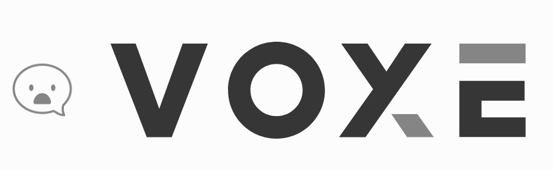

  </a>

 <h3 align=center  style="background-color: #fcfcfc; color: #363636; ">Chat Service </h3>

Instructions
------------

1. Install [Rust](http://www.rust-lang.org/install.html)

2. Clone the [VOXe](https://github.com/mpf0007/VOXe) source code .  

3. Run `cargo build` to build VOXe , and `cargo run` to run it.

To build and run with optimizations enabled, use `cargo build --release` and
`cargo run --release`.
